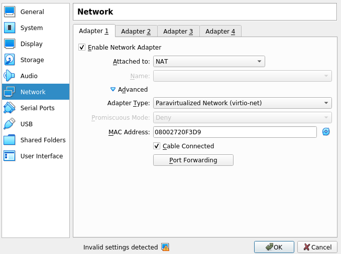
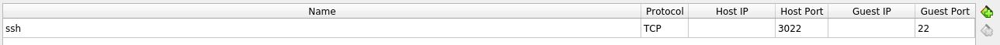

# NixOS ROS Generation & Rollback

## NixOS Generation & Virtualization

- This flake installs ros and the ros packages declared in `systemPackages` of ros.nix for multiple targets
- It sets up systemd services for the `roscore`, `talker` and `listener` in the VM

## Learning Goals

- Build a VM as a Nix Package on your machine using nix build

- Be able to ssh into this VM

- Introspect the systemd service and the ros communication

- Deploy and NixOS update via ssh into the VM

- Monitor a rollback after a second wrong deployment

- Monitor the restart behavior of systemd services started and stopped by NixOS

## Side Notes

- Observe that the previous configuration of a ros service is now used as a module https://github.com/mag-nix/ros-rollback/blob/main/configuration/ros.nix

- When sending an update to the VM we need to tell it about its configuration (disks, boot-loader location, ..) https://github.com/mag-nix/ros-rollback/blob/main/hardware-configuration/vm-hardware-configuration.nix

``` nix
nixosConfigurations.nixos-vm = nixpkgs.lib.nixosSystem {
  inherit system;
  specialArgs = attrs;
  modules = [
    ./hardware-configuration/vm-hardware-configuration.nix
    nix-ros-overlay.nixosModules.default
    ./configuration/configuration-vm.nix
  ];
};
```

- Deploy-rs is one way to achieve delivery and rollback. We could extend this to also rollback when our system operates not as expected

- There also would need to be a way to deal with the update and rollback of e.g. databases or data in general which is not covered here

## Usage of Virtual Box

``` bash
nix build .#vbox
```

- Install Virtual Box
- Import Appliance
- Use `nixos-*-x86_64-linux.ova` file for new vm



- Set port forwarding from local host to vm



## Usage of QEMU

Install qemu

### Build image

``` bash
nix build .#qemu
```

### Make it writable

``` bash
cp result/nixos.qcow2 .
chmod +w nixos.qcow2
```

### Import the image

``` bash
sudo virt-install --name rollback --ram 2048 --disk nixos.qcow2 --import  --nographics --os-type=generic --check all=off --hvm
```

### Direcly access VM

``` bash
virsh console rollback
```

### Stop and Remove Qemu VM

After we are done with the vm we can stop and remove it.

``` bash
# Stop
sudo virsh shutdown rollback
# Remove
sudo virsh undefine rollback
```

## ssh into vm

### Virtual Box

``` bash
ssh -p 3022 robotix@127.0.0.1
```

### QEMU

``` bash
ssh robotix@192.168.122.10
```

### Password

Use the password `robot` defined in `configuration/configuration-vm.nix`

``` nix
initialPassword = "robot";
```

### Testing

Check the services using

``` bash
systemctl status talker.service
systemctl status listener.service
systemctl status roscore.service
```

Or use ROS for introspection

``` bash
rostopic echo /chatter
```

## Add your public ssh key

The configuration is to be defined in `configuration/configuration-vm.nix`

``` nix
openssh.authorizedKeys.keys = [
    "ssh-ed25519 AAAAbbbzzz name@machine"
];
```

## Deploy to vm using deploy-rs **without** rollbacks

Use `nix flake check` to see whether your configuration is good to go.

Get into a shell with `deploy-rs` installed using `flake.nix`

``` nix
devShell.${system} = pkgs.mkShell {
    buildInputs = [ pkgs.deploy-rs ];
    inputsFrom = [ ];
};
```

``` bash
nix develop
# virtual box
deploy .#local-vm
# qemu
deploy .#local-qemu-first
```

## Deploy to vm using deploy-rs **with** rollbacks

Turn rollbacks on in `flake.nix` or use `.#local-qemu`

``` nix
autoRollback = true;
magicRollback = true;
```

And break the ssh connection by disabling the ssh daemon service in `configuration/configuration-vm.nix`

``` nix
services.sshd.enable = false;
```

Now you should be able to observe the magic rollback (default: 30 sec)

``` bash
deploy .#local-vm
deploy .#local-qemu
```

If you like to have prove; turn on monitoring of the ssh service in the directly connected terminal (non-ssh):

``` bash
watch --interval 1 systemctl status sshd.service
```

Watch it disappear and reappear in accordance to the progress of the deployment

## Deploy a new configuration

Lets fix `sshd` by setting it to true again and change ros. For example use different talker and listener:

``` nix
nodes = {
    talker = {
    # ROS Package naming
    package = "rospy_tutorials";
    # ROS Node
    # node = "talker";
    node = "talker_header.py";
    };

    listener = {
    package = "rospy_tutorials";
    # node = "listener";
    node = "listener_header.py";
    };
};
```

Deploy asks nix to send this new configuration to the robot. Nix knows to prepare new systemd services and turn of the no longer needed services. In that way the `roscore.service` was not restarted since it was not changed (!)

``` bash
deploy .#local-vm
deploy .#local-qemu
```

## Commands

### Setup Repo

``` bash
cd ~/mag-nix
git clone https://github.com/mag-nix/ros-rollback.git
cd ros_rollback
```

### Setup VM

``` bash
nix build .#qemu
cp result/nixos.qcow2 .
chmod +w nixos.qcow2
sudo virt-install --name rollback --ram 2048 --disk nixos.qcow2 --import  --nographics --os-type=generic --check all=off --hvm
```

### Analyze VM

``` bash
# [VM]
nixos-rebuild list-generations --fast

# [HOST]
nix develop
deploy .#local-qemu-first

# [VM]
nixos-rebuild list-generations --fast

# [HOST] Change things & enable the two roll back methods of deploy-rs
deploy .#local-qemu

# TODO: Break the ssh connection in the configuration-vm.nix
# [VM] in console not via ssh
watch -n 1 "nixos-rebuild list-generations --fast && systemctl status sshd.service"

# [HOST]
deploy .#local-qemu
```

## Hints

You can create a local clean shell by using

``` bash
# Start a shell with only nix git curl and nvim
nix-shell -p nix git curl neovim --pure
```

This way the installed packages on your machine don’t get into your way
